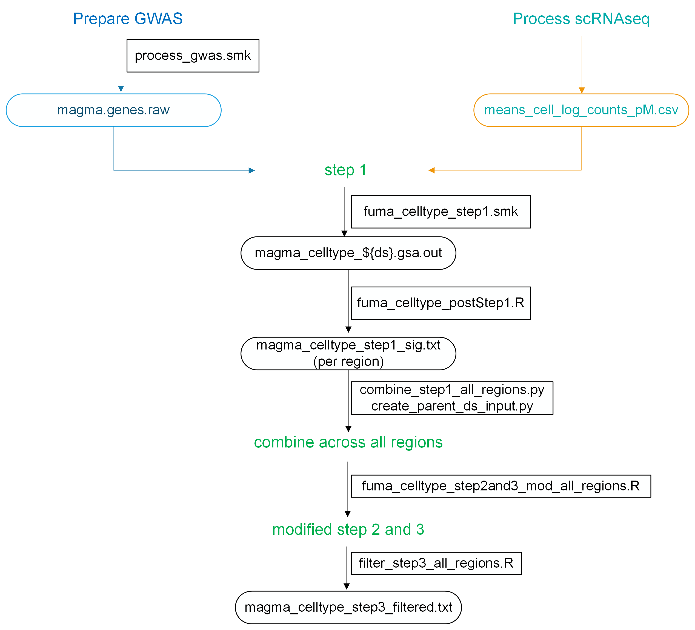

# FUMA_Celltype_cmd
- This repo hosts codes for running FUMA Cell Type on the command line. 
**Disclaimer:** use as own risk. I do not guarantee that the results will match 100% with the outputs from FUMA. 
- The script `code/fuma_celltype_step2and3.R` is based off of the script https://github.com/vufuma/FUMA-webapp/blob/master/scripts/magma_celltype/magma_celltype.R (credit: Kyoko Watanabe). 
    - The original script was written to be run as part of FUMA Celltype.
    - I adapted the original script to make it into a standalone script that can be run locally on the command line, instead of having to submit to FUMA

- I set up a snakemake pipeline to run the Rscript: `code/fuma_celltype_step2_3.smk`. Examples to run: 
```
snakemake -s code/fuma_celltype_step2_3.smk --configfile code/config_fuma_ct_step2_3.json -j 
```

## Instructions to run FUMA Cell type original workflow
### Step 1: 
- snakemake: `code/fuma_celltype_step1.smk`
- configfile: `code/config_fuma_ct_step1.json`. How to set up the config file for step 1:
    - Content of the `gwas_dir` directory `/Processed_GWAS/magma/out/` contains a folder called `protein_coding_ensemble`. In it there are outputs from MAGMA. 
    ```
    ── protein_coding_ensemble
        ├── gwas_10_protein_coding_ensemble_magma.genes.out
        ├── gwas_10_protein_coding_ensemble_magma.genes.raw
        ├── gwas_10_protein_coding_ensemble_magma.log
        ├── gwas_10_protein_coding_ensemble_magma.log.suppl
    ```
    - Content of the `scrna_dir` directory `/Processed_scRNA/data/magma/` contains a folder for each scRNAseq. For example: 
    ```
    ── 14_Siletti_CerebralCortex.SMG_Human_2022
    │   ├── cell_type_level_1
    │   │   ├── means_cell_log_counts_pM.tsv
    │   │   └── spec_cell_log_counts_pM.tsv
    │   ├── cell_type_level_2
    │   │   ├── means_cell_log_counts_pM.tsv
    │   │   └── spec_cell_log_counts_pM.tsv
    ```
- run command: `snakemake -s fuma_celltype_step1.smk --rerun-incomplete -j -k --configfile config_fuma_ct_step1.json`

### Step 2 and 3: 
- The snakemake file is currently set up so that it will run step 2 and 3 for all of the scRNAseq specified in a file, which is `{region}_scrna_ids.txt`
- Create files `{region}_scrna_ids.txt` where region corresponds to the region of interest. In this example, the `region` is specified in the config file `code/config_fuma_ct_step2_3.json` is brain. So create a file called `brain_scrna_ids.txt`. Contents of the file should include the IDs and the cell type level 
```
ids
14_Siletti_CerebralCortex.SMG_Human_2022_level_2
15_Siletti_CerebralCortex.Ig_Human_2022_level_2
16_Siletti_CerebralCortex.IFG.A44-A45_Human_2022_level_2
17_Siletti_CerebralCortex.PoCG.S1C_Human_2022_level_2
18_Siletti_CerebralCortex.SCG.A25_Human_2022_level_2
```

- Create a directory `/celltype/{trait}/{region}/` 
    - Move the outputs from step 1 to appropriate folder
    - Note that this was necessary when running multiple traits across multiple regions at the same time. 
    - Make sure that in this directory, the files are named `magma_celltype_{ds}.gsa.out` where `ds` is the dataset in the file `{region}_scrna_ids.txt`
    - In summary in this step, prepare the input folder in the correct format. This should be done programmically. Code will be provided soon. 

- Create a directory `/magma_covs/celltype`. The files in this directory are for example: `14_Siletti_CerebralCortex.SMG_Human_2022_level_2.txt`. One can do: 
```
cp /Processed_scRNA/data/magma/14_Siletti_CerebralCortex.SMG_Human_2022/cell_type_level_2/means_cell_log_counts_pM.tsv /magma_covs/celltype/14_Siletti_CerebralCortex.SMG_Human_2022_level_2.txt
```

- Note that the reason why this was set up this way was because the file structures for the processed scRNAseq data was set up first before implementing step2 and 3. TODO in the future is to make the file structure easier/less redundant. 

# Modified workflow
- Modified FUMA cell type that was used in Phung et al. 202x


- Note that in order to adapt these following scripts to new analyses, one need to modify variables and paths, etc... Please contact Tanya if you need help with this. 
- Step 1: 
    - snakemake: `code/fuma_celltype_step1.smk`
    - configfile: `code/config_fuma_ct_step1.json`
    - run command: `snakemake -s fuma_celltype_step1.smk --rerun-incomplete -j -k --configfile config_fuma_ct_step1.json`
- Step 2 and 3: 
    - snakemake: `code/fuma_celltype_step2and3_mod_all_regions.R`
    - run command: `snakemake -s modified_fuma_celltype_step2_3.smk --rerun-incomplete -j -k`